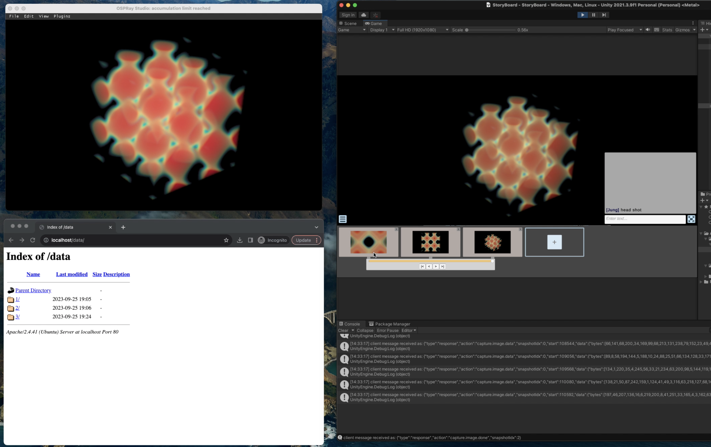

# V-Mail Unity client for OSPRay Studio 
> This project is part of a larger project called [Immersive OSPRay Studio](https://github.com/jungwhonam/ImmersiveOSPRay) and [Visualization Mail (V-Mail)](https://github.com/JungWhoNam/VisualizationMail).

 ## Overview

We extended [V-Mail Unity client v1.0.0](https://github.com/JungWhoNam/VisualizationMail/releases) to support message creations with [OSPRay Studio v1.0.0](https://github.com/RenderKit/ospray-studio/releases/tag/v1.0.0). This enables users to create annotated, animated stories directly from OSPRay Studio.

In the above image, you see three applications:
1. Top-left: [OSPRay Studio with V-Mail plugin](https://github.com/JungWhoNam/ospray_studio/tree/jungwho.nam-feature-plugin-storyboard/plugins/storyboard_plugin)
2. Bottom-left: [V-Mail server](https://github.com/JungWhoNam/VisualizationMailServer) for managing created stories
3. Right: Unity client for constructing a story (this repo)

## Run
1. First, start the server by following the steps written in [the server repo](https://github.com/JungWhoNam/VisualizationMailServer).
2. Open this project in Unity (this is built-in Unity 2021.3.9f1).
3. Play `Storyboard/StoryBoard.unity`.
4. Start OSPRay Studio V-Mail plugin by following the steps written in [the plugin repo](https://github.com/JungWhoNam/ospray_studio/tree/jungwho.nam-feature-plugin-storyboard/plugins/storyboard_plugin).

## Modify the V-Mail Server and OSPRay Studio plugin
For the V-Mail server,
* Change the `ServerURL` variable in `Storyboard/Scripts/WebIntegration.cs`. 
  * The default value is "http://localhost/".
* Change the `ServerDataDir` variable in `Storyboard/Scripts/WebIntegration.cs`. 
  * The default value is "data/".

For the OSPRay Studio plugin,
* Modify the `tcpListener` initialization in `Storyboard/Scripts/TCPServer.cs`. 
  * The default IP address is "127.0.0.1".
  * The default port number is "8052".

## Known Issues
`ffmpeg` can't be opened because it's from an unidentified developer.
- This error might appear when playing the demo scene in the Editor and uploading changes. This can be solved by running `Assets/StreamingAssets/ffmpeg/Mac/ffmpeg` in Terminal once. This should be not be a problem in build.

Currently, we are only saving camera states. In the future, we plan to capture the entire scene, including material properties, lighting, and more.
